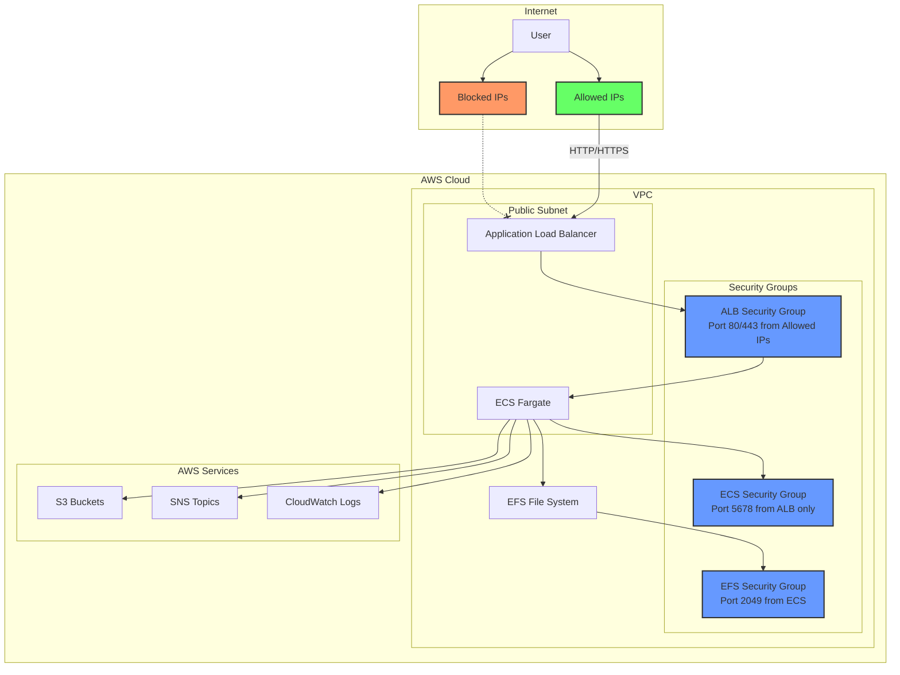
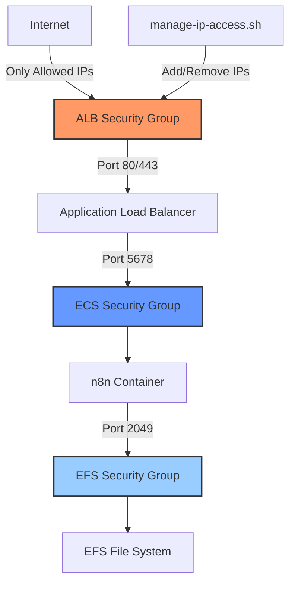

# n8n AWS CDK Deployment

This project contains AWS CDK infrastructure code for deploying n8n workflow automation tool on AWS ECS with Fargate.

## Architecture

The deployment consists of:
- n8n container running on AWS Fargate
- EFS volume for data persistence
- IAM roles for AWS service access (S3, SNS)
- Application Load Balancer for access
- Security groups for network access control

### Architecture Diagram



### Security Architecture



## Cost Estimation

### Monthly Cost Breakdown (US East 1)

The following estimates are based on typical usage patterns and US East 1 pricing (as of 2024). Actual costs may vary based on usage, region, and AWS pricing changes.

#### Core Infrastructure Costs

| Service | Configuration | Monthly Cost (USD) | Notes |
|---------|---------------|-------------------|-------|
| **ECS Fargate** | 1 vCPU, 2GB RAM, 24/7 | ~$29.50 | 730 hours/month × $0.04048/hour |
| **Application Load Balancer** | Standard ALB | ~$16.20 | $0.0225/hour + data processing |
| **EFS Storage** | 5GB General Purpose | ~$1.50 | $0.30/GB/month |
| **CloudWatch Logs** | 1GB/month retention | ~$0.50 | $0.50/GB ingested |
| **VPC & Networking** | Standard usage | ~$0.00 | No NAT Gateway, minimal data transfer |

**Base Monthly Cost: ~$47.70**

#### Variable Costs (Usage-Based)

| Service | Usage Pattern | Monthly Cost (USD) | Notes |
|---------|---------------|-------------------|-------|
| **Data Transfer** | 10GB outbound | ~$0.90 | $0.09/GB after first 1GB free |
| **S3 Storage** | 10GB Standard | ~$0.23 | $0.023/GB/month |
| **S3 Requests** | 10K GET, 1K PUT | ~$0.01 | Minimal API request costs |
| **SNS Messages** | 1K messages | ~$0.50 | $0.50/million messages |

**Variable Monthly Cost: ~$1.64**

### Total Estimated Monthly Cost

| Scenario | Monthly Cost (USD) | Annual Cost (USD) |
|----------|-------------------|-------------------|
| **Minimal Usage** | $47.70 - $55.00 | $572 - $660 |
| **Light Usage** | $55.00 - $75.00 | $660 - $900 |
| **Moderate Usage** | $75.00 - $120.00 | $900 - $1,440 |

### Cost Optimization Tips

#### Immediate Savings
- **EFS Lifecycle Policy**: Automatically moves files to Infrequent Access after 14 days (already configured)
- **CloudWatch Log Retention**: Set to 1 week for development (already configured)
- **Right-sizing**: Monitor CPU/memory usage and adjust Fargate configuration if needed

#### Production Optimizations
- **Reserved Capacity**: Consider Fargate Spot or Savings Plans for predictable workloads
- **Multi-AZ vs Single-AZ**: Current setup uses multi-AZ for reliability; single-AZ reduces ALB costs
- **EFS Performance Mode**: Use Provisioned Throughput only if needed
- **CloudWatch Logs**: Use log filtering to reduce ingestion costs

#### Regional Cost Variations
Costs can vary by region. Some examples:
- **US East 1 (N. Virginia)**: Baseline pricing (shown above)
- **US West 2 (Oregon)**: ~5-10% higher
- **EU West 1 (Ireland)**: ~10-15% higher
- **AP Southeast 1 (Singapore)**: ~15-25% higher

### Cost Monitoring Setup

To monitor your actual costs:

1. **Enable Cost Explorer** in AWS Console
2. **Set up Billing Alerts**:
   ```bash
   # Create a billing alarm for $100/month
   aws cloudwatch put-metric-alarm \
     --alarm-name "n8n-monthly-cost" \
     --alarm-description "Alert when n8n costs exceed $100/month" \
     --metric-name EstimatedCharges \
     --namespace AWS/Billing \
     --statistic Maximum \
     --period 86400 \
     --threshold 100 \
     --comparison-operator GreaterThanThreshold
   ```

3. **Tag Resources** for cost allocation:
   - All resources are tagged with `Project: n8n-cdk`
   - Use Cost Explorer to filter by tags

### Free Tier Benefits

New AWS accounts include free tier benefits that can reduce initial costs:
- **ECS Fargate**: No free tier
- **ALB**: 750 hours/month for first year
- **EFS**: 5GB storage for first year
- **CloudWatch**: 10 custom metrics and 5GB log ingestion
- **Data Transfer**: 1GB/month outbound

**Estimated First-Year Savings with Free Tier: ~$200**

## Prerequisites

- AWS CLI configured with appropriate permissions
- Python 3.6 or higher
- AWS CDK installed (`npm install -g aws-cdk`)

## Project Structure

```
.
├── cdk/                    # CDK application code
│   ├── app.py             # CDK app entry point with region support
│   ├── cdk/               # CDK stack definition
│   │   └── cdk_stack.py   # Main infrastructure stack
│   ├── ip_detection.py    # IP detection and validation utilities
│   └── tests/             # Unit tests
├── data/                  # Example data files for n8n workflows
│   └── example-data.json  # Sample data format
├── deploy.sh              # Deployment script with region support
├── cleanup.sh             # Resource cleanup script
├── manage-ip-access.sh    # IP access management utility
├── upload_data.sh         # Script to upload data to n8n container
└── upload_to_s3.sh        # Script to upload data to S3 bucket
```

## Deployment Instructions

1. Clone this repository
2. Configure AWS credentials:
   ```
   aws configure
   ```
3. Create and activate a Python virtual environment:
   ```bash
   cd cdk
   python3 -m venv .venv
   source .venv/bin/activate
   pip install -r requirements.txt
   cd ..
   ```
4. Bootstrap the CDK environment (one-time setup per AWS account/region):
   ```bash
   cd cdk
   # Get your AWS account ID
   AWS_ACCOUNT=$(aws sts get-caller-identity --query "Account" --output text)
   
   # Bootstrap with the required qualifier
   cdk bootstrap aws://$AWS_ACCOUNT/YOUR_REGION --qualifier n8npoc
   cd ..
   ```
5. Run the deployment script:
   ```bash
   # Deploy to a specific region (region is mandatory)
   ./deploy.sh --region us-west-2
   
   # Deploy with allowed IP addresses
   export ALLOWED_IPS="203.0.113.1,198.51.100.1"
   ./deploy.sh --region eu-west-1
   ```
6. Add your IP address to access n8n:
   ```bash
   # Get the security group ID from the stack outputs
   SG_ID=$(aws cloudformation describe-stacks --stack-name N8nStack --query "Stacks[0].Outputs[?OutputKey=='ALBSecurityGroupId'].OutputValue" --output text)
   
   # Add your current IP
   ./manage-ip-access.sh add $(curl -s https://checkip.amazonaws.com)/32 "My IP" --sg-id $SG_ID
   ```
7. Access n8n using the URL provided in the output

## AWS Service Integrations

The n8n deployment includes IAM permissions for common AWS services:

### S3 Integration
- Read-only access to S3 buckets
- Use the S3 node in n8n to connect to your buckets

### SNS Integration
- Permissions to publish to SNS topics
- Use the AWS node to send notifications

## Data Management

The project includes utilities for managing data files that can be used with n8n workflows:

### Data Directory

The `data/` directory serves as a location for:
- Example data files (example-data.json is provided)
- Your own workflow data files
- Files you want to upload to S3 or directly to the n8n container

### Uploading Data to S3

The `upload_to_s3.sh` script helps you upload data files to S3:

```bash
# Add your data files to the data/ directory
# Then run the script with your region
./upload_to_s3.sh --region us-west-2

# You can also specify a different stack name
./upload_to_s3.sh --region us-west-2 --stack-name MyN8nStack
```

This will:
1. Create an S3 bucket with a unique name
2. Upload all files from the data/ directory to the bucket
3. Configure permissions for the n8n task role to access the files
4. Output the bucket name for use in n8n workflows

### Uploading Data to n8n Container

The `upload_data.sh` script provides instructions for uploading data directly to the n8n container:

```bash
# Get information about your deployment
./upload_data.sh --region us-west-2

# You can also specify a different stack name
./upload_data.sh --region us-west-2 --stack-name MyN8nStack
```

This will show you commands to:
1. Create a temporary S3 bucket
2. Upload your files to S3
3. Use ECS execute-command to download files to the container

## Customization

To customize the deployment:

1. Edit `cdk/cdk/cdk_stack.py` to modify the infrastructure
2. Update environment variables in the container definition
3. Add additional AWS service permissions as needed

### Useful CDK Commands

When working with the CDK code in the `cdk` directory:

* `cdk ls` - List all stacks in the app
* `cdk synth` - Emit the synthesized CloudFormation template
* `cdk deploy` - Deploy the stack to your AWS account/region
* `cdk diff` - Compare deployed stack with current state
* `cdk docs` - Open CDK documentation

## Cleanup

To remove all resources:

```
./cleanup.sh
```

## Sharing with Others

To share this POC with others:

1. Share this repository
2. They should update their AWS credentials
3. Run the deployment script in their own AWS account

## Security Features

### IP Access Control

**⚠️ IMPORTANT: By default, this deployment is completely closed with no access allowed. You must explicitly allowlist IP addresses during deployment or add them after deployment to gain access to the n8n web portal.**

#### Specifying Allowed IPs During Deployment

When deploying the stack, you can specify allowed IP addresses using the `ALLOWED_IPS` environment variable:

```bash
# Allow access from a single IP address
export ALLOWED_IPS="203.0.113.1"

# Allow access from multiple IP addresses (comma-separated)
export ALLOWED_IPS="203.0.113.1,198.51.100.1"

# Allow access from an IP range using CIDR notation
export ALLOWED_IPS="203.0.113.0/24"

# Deploy with the specified IP restrictions
./deploy.sh
```

#### Managing IP Access After Deployment

We provide a utility script to help manage IP access after deployment:

```bash
# Show your current public IP
./manage-ip-access.sh current

# List currently allowed IPs (replace with your security group ID)
./manage-ip-access.sh list --sg-id sg-1234567890abcdef0

# Add your current IP to allowed list
./manage-ip-access.sh add $(curl -s https://checkip.amazonaws.com)/32 "My workstation" --sg-id sg-1234567890abcdef0

# Remove an IP from allowed list
./manage-ip-access.sh remove 203.0.113.1/32 --sg-id sg-1234567890abcdef0
```

For detailed instructions on IP access management, see [IP Access Control Documentation](docs/ip-access-control.md).

#### IP Address Formats

The system accepts both individual IP addresses and CIDR blocks:

- **Single IP**: `203.0.113.1` (automatically converted to `203.0.113.1/32`)
- **CIDR Block**: `192.168.1.0/24` (allows entire subnet)
- **Multiple IPs**: Specify multiple entries in configuration file

#### Troubleshooting Access Issues

If you can't access n8n after deployment:

1. **Check your current IP**:
   ```bash
   curl https://api.ipify.org
   ```

2. **Verify security group rules**:
   ```bash
   aws ec2 describe-security-groups \
     --group-ids $SECURITY_GROUP_ID \
     --query "SecurityGroups[0].IpPermissions"
   ```

3. **Add your current IP**:
   ```bash
   # Replace with your actual IP
   aws ec2 authorize-security-group-ingress \
     --group-id $SECURITY_GROUP_ID \
     --protocol tcp \
     --port 80 \
     --cidr $(curl -s https://api.ipify.org)/32
   ```

4. **Check ALB health**:
   ```bash
   aws elbv2 describe-target-health \
     --target-group-arn $TARGET_GROUP_ARN
   ```


#### Security Best Practices

1. **Regular IP Review**: Periodically review and remove unused IP addresses
2. **Use CIDR Blocks**: For office networks, use CIDR blocks instead of individual IPs
3. **VPN Considerations**: If using VPN, add VPN exit IP addresses
4. **Dynamic IPs**: Be aware that ISP-assigned IPs may change
5. **Team Access**: Maintain a list of team member IPs in the configuration file

### Additional Security Considerations

For production deployments, also consider:

- **HTTPS/TLS**: Add SSL certificate and custom domain
- **WAF**: Implement Web Application Firewall
- **Private Subnets**: Move containers to private subnets with NAT Gateway
- **Secrets Management**: Use AWS Secrets Manager for sensitive data
- **IAM Hardening**: Use more granular IAM permissions
- **Monitoring**: Set up CloudWatch alarms for security events
- **Backup**: Implement automated EFS backups
- **Compliance**: Ensure compliance with relevant security standards
